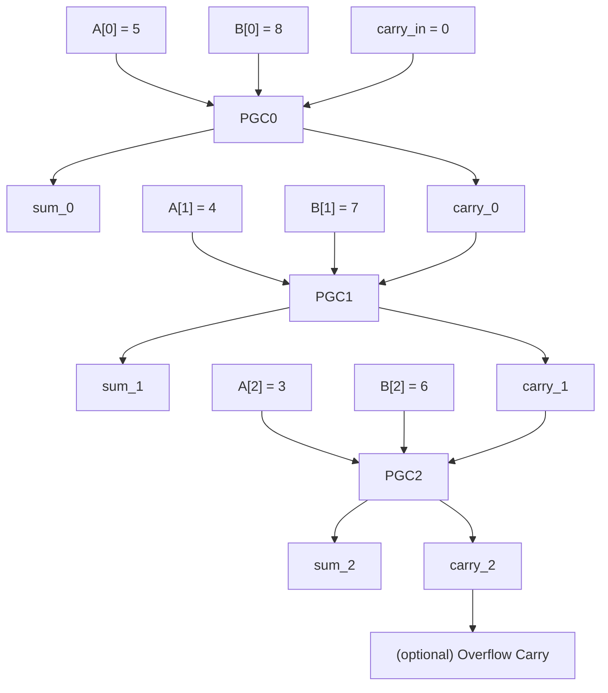

```
[Input Layer - Rightmost Digit (Units Place)]

 A[0] = 5
 B[0] = 8
 CarryIn = 0
 ┌─────────────────────────────────────┐
 │           PGC0: DigitAdder          │
 │ Inputs: 5, 8, 0                     │
 │ Outputs: Sum_0 = 3, Carry_0 = 1     │  ← 13 → write 3, carry 1
 └─────────────────────────────────────┘

[Middle Digit (Tens Place)]

 A[1] = 4
 B[1] = 7
 CarryIn = Carry_0 = 1
 ┌─────────────────────────────────────┐
 │           PGC1: DigitAdder          │
 │ Inputs: 4, 7, 1                     │
 │ Outputs: Sum_1 = 2, Carry_1 = 1     │  ← 12 → write 2, carry 1
 └─────────────────────────────────────┘

[Leftmost Digit (Hundreds Place)]

 A[2] = 3
 B[2] = 6
 CarryIn = Carry_1 = 1
 ┌─────────────────────────────────────┐
 │           PGC2: DigitAdder          │
 │ Inputs: 3, 6, 1                     │
 │ Outputs: Sum_2 = 0, Carry_2 = 1     │  ← 10 → write 0, carry 1
 └─────────────────────────────────────┘

[Final Carry-Out]

 ┌────────────┐
 │ Carry_2 = 1│ → prepend to output
 └────────────┘

Final result = 1023
```


graph TD

  %% Inputs for Units Place
  A0["A[0] = 5"]
  B0["B[0] = 8"]
  Cin0["CarryIn = 0"]
  A0 --> PGC0
  B0 --> PGC0
  Cin0 --> PGC0

  %% PGC0 output
  PGC0["PGC0: add(5,8,0)"]
  PGC0 --> S0["Sum[0] = 3"]
  PGC0 --> C0["Carry[0] = 1"]

  %% Inputs for Tens Place
  A1["A[1] = 4"]
  B1["B[1] = 7"]
  C0 --> PGC1
  A1 --> PGC1
  B1 --> PGC1

  %% PGC1 output
  PGC1["PGC1: add(4,7,1)"]
  PGC1 --> S1["Sum[1] = 2"]
  PGC1 --> C1["Carry[1] = 1"]

  %% Inputs for Hundreds Place
  A2["A[2] = 3"]
  B2["B[2] = 6"]
  C1 --> PGC2
  A2 --> PGC2
  B2 --> PGC2

  %% PGC2 output
  PGC2["PGC2: add(3,6,1)"]
  PGC2 --> S2["Sum[2] = 0"]
  PGC2 --> C2["Carry[2] = 1"]

  %% Final carry
  C2 --> Cout["Final Carry = 1"]

  %% Final output
  Cout --> Output["Final Result = 1 0 2 3"]
  S2 --> Output
  S1 --> Output
  S0 --> Output
