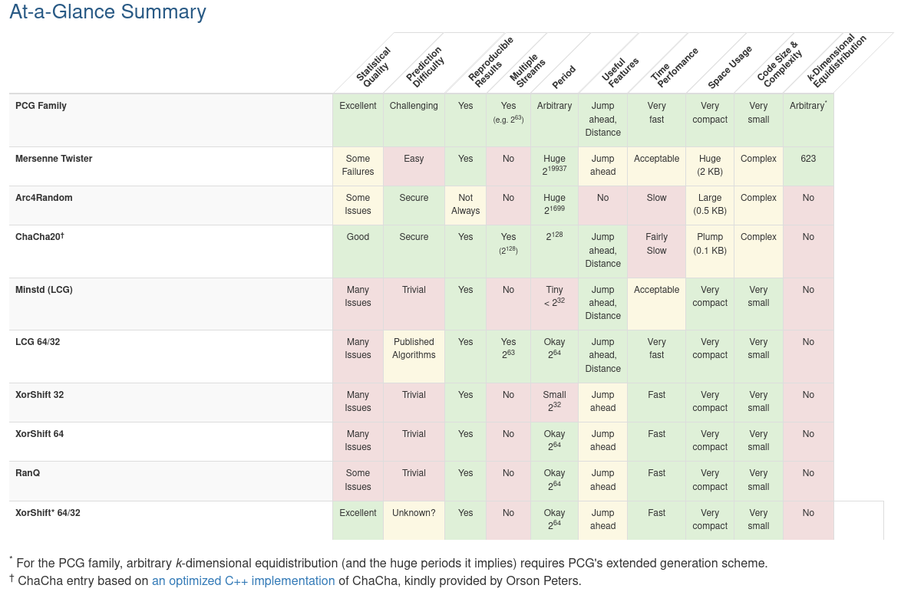

# Permuted Congruential Generator (PCG)
https://en.wikipedia.org/wiki/Permuted_congruential_generator

## PCG, A Family of Better Random Number Generators
https://www.pcg-random.org/

PCG is a family of simple fast space-efficient statistically good algorithms for random number generation. Unlike many general-purpose RNGs, they are also hard to predict.

https://www.youtube.com/watch?v=45Oet5qjlms

